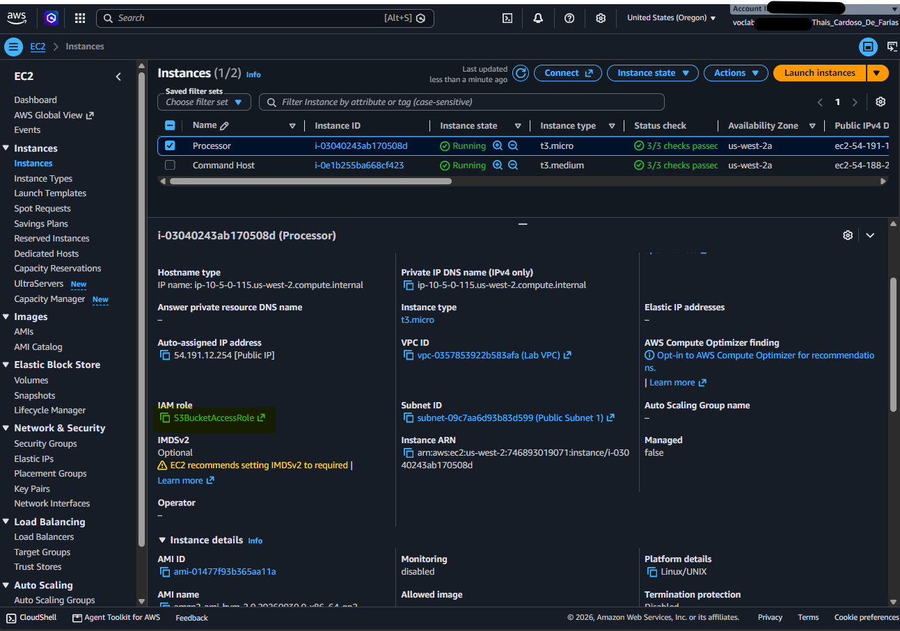
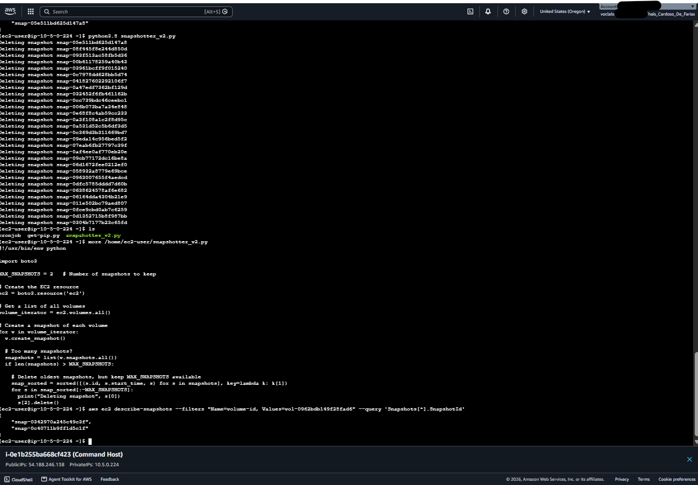
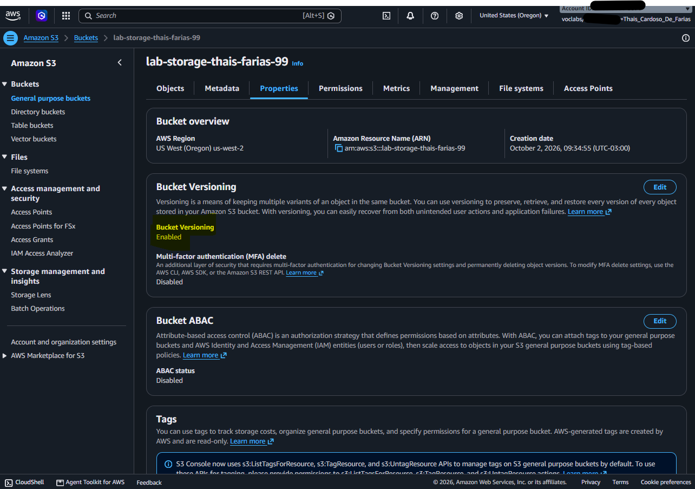
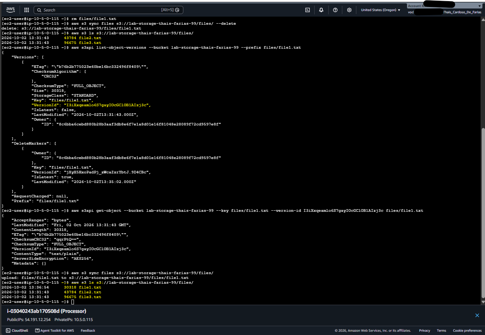

# AWS Storage Management & Disaster Recovery Lab

Este repositório contém a documentação e evidências do laboratório prático de **Gestão de Armazenamento na AWS**. O objetivo principal do projeto é demonstrar a automação no gerenciamento de snapshots do Amazon EBS, integração/sincronização de volumes com o Amazon S3 via AWS CLI, e implementação de estratégias de recuperação de dados usando versionamento no S3.

---

## 📐 Arquitetura da Solução

O ambiente provisionado no laboratório é composto por:
* **VPC & Subnet Pública**: Infraestrutura de rede para alocação dos recursos.
* **EC2 Command Host**: Instância de gerenciamento para execução de comandos CLI e administração.
* **EC2 Processor**: Instância de processamento conectada a um volume EBS e configurada com perfil do IAM para acesso ao S3.
* **Amazon EBS Volume**: Volume de bloco anexado à instância Processor.
* **Amazon S3**: Bucket com versionamento ativado para backup durável e sincronização de arquivos.

---

## 🛠️ Tecnologias e Ferramentas

* **Provedor Cloud**: AWS (EC2, EBS, S3, IAM)
* **Ferramentas de Linha de Comando**: AWS CLI
* **Linguagens & Utilitários**: Python 3.8, Bash, Linux Cron
* **Conceitos Chave**: Disaster Recovery (DR), Lifecycle & Retention Policy, Object Versioning, IAM Roles

---

## 🚀 Etapas do Projeto e Evidências

### 1. Governança de Acesso e Permissões (IAM Role)
Para permitir que a instância `Processor` acesse os serviços da AWS (EBS e S3) de forma segura e sem expor chaves de acesso no código, foi anexada a ela a IAM Role `S3BucketAccess`.

---

### 2. Automação e Políticas de Retenção de Snapshots (EBS + Python)
Para manter o ambiente otimizado e evitar custos excessivos com armazenamento:
1. Um agendamento via **Cron** foi configurado para gerar snapshots recorrentes do volume EBS.
2. Um script em Python (`snapshotter_v2.py`) foi executado para avaliar a quantidade de snapshots do volume, ordená-los por data e deletar automaticamente todos os snapshots antigos, retendo apenas os **2 mais recentes**.

---

### 3. Sincronização de Dados e Versionamento no Amazon S3
Para garantir alta durabilidade e resiliência dos dados locais da instância:
1. Habilitou-se o **versionamento de objetos** no bucket Amazon S3 de destino.
2. Os dados contidos no diretório local foram sincronizados com o bucket usando o comando `aws s3 sync`.

---

### 4. Simulação de Desastre e Recuperação de Arquivos Deletados
Para validar a estratégia de *Disaster Recovery*:
1. Um arquivo local (`file1.txt`) foi removido da instância e sincronizado com a flag `--delete`, o que gerou um *Delete Marker* no Amazon S3.
2. Utilizando o comando `aws s3api list-object-versions`, identificou-se o ID da versão anterior (`VersionId`).
3. O arquivo foi recuperado com `aws s3api get-object` e re-sincronizado com sucesso para o bucket S3.

---

## 🎯 Competências Demonstradas

* **Otimização de Custos em Nuvem**: Automação da limpeza de recursos orfãos/antigos (Snapshots EBS) utilizando Python.
* **Sincronização Eficiente de Dados**: Uso de comandos otimizados da AWS CLI (`aws s3 sync`) para backup contínuo.
* **Proteção contra Perda de Dados (DR)**: Uso prático de versionamento no S3 e manipulação de objetos via `s3api` para restauração *point-in-time*.
* **Segurança na Nuvem**: Aplicação do princípio do menor privilégio através de IAM Roles e Instance Profiles.
